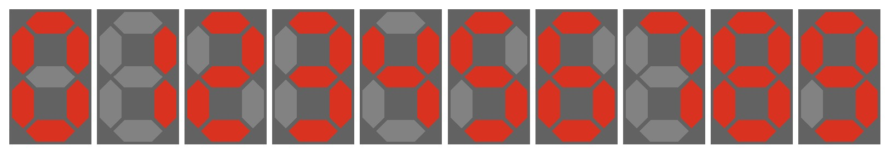

## Krok 1 - Przygotowanie jednego segmentu wyświetlacza 7 segementowego

Pojedyczńca cyfra

```html
<body>
  <div class="segment digit-0">
    <div class="bar-h bar-a"></div>
    <div class="bar-h bar-b"></div>
    <div class="bar-h bar-c"></div>
    <div class="bar-v bar-v-t bar-d"></div>
    <div class="bar-v bar-v-t bar-e"></div>
    <div class="bar-v bar-v-b bar-f"></div>
    <div class="bar-v bar-v-b bar-g"></div>
  </div>
</body>
```



[Wyświetlacz 7-segmentowy](doc/step01.md)

## Krok 2 - WebComponent - komponent html'a

Reużywalny komponent cyfry
```html
<body>
  <segment-box class="digit-0"></segment-box>
  <segment-box class="digit-1"></segment-box>
  <segment-box class="digit-2"></segment-box>
  <segment-box class="digit-3"></segment-box>
  <segment-box class="digit-4"></segment-box>
  <segment-box class="digit-5"></segment-box>
  <segment-box class="digit-6"></segment-box>
  <segment-box class="digit-7"></segment-box>
  <segment-box class="digit-8"></segment-box>
  <segment-box class="digit-9"></segment-box>
</body>
```


[WebKomponent](doc/step02.md)